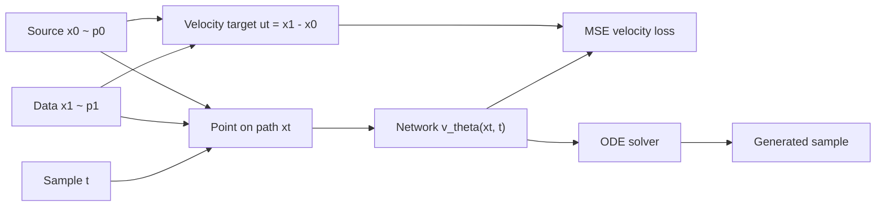

## Introduction

Flow matching is a generative modeling framework built around a velocity field. Instead of learning a denoising step for a fixed noise schedule, the model learns how points should move along a continuous path from a source distribution to the data distribution. Lipman et al. present the framework as a self-contained guide with a PyTorch package and examples for image and text generation [Flow Matching Guide and Code](https://arxiv.org/abs/2412.06264).

The practical object is simple: learn $v_\theta(x, t)$, a neural velocity field. During sampling, start from $x_0 \sim p_0$ and integrate the learned field until $t=1$. If the field is good, the final sample follows the data distribution.


The figure is original, but its visual plan is based on cited explanations of probability paths and velocity fields rather than copied diagrams. The goal of the first part is to keep the usable sequence visible: path, target velocity, loss, code result, then the theory that justifies the regression target.

## Problem setup

Let $p_0$ be an easy source distribution, usually a standard Gaussian, and let $p_1$ be the target data distribution. A time-dependent flow moves a point by the ordinary differential equation

$$
\frac{d x_t}{dt} = v_t(x_t), \qquad x_0 \sim p_0.
$$

The distribution of $x_t$ changes over time. We can call this changing distribution $p_t$. The ideal goal is to choose a velocity field $v_t$ such that $p_t$ starts at $p_0$ and ends at $p_1$.

The direct regression target is not available in real data. At intermediate times, we do not know the exact marginal distribution $p_t$ or the exact global velocity $v_t$. This is why conditional flow matching is useful: it creates tractable supervised targets by conditioning on sampled endpoints.

## Core construction

Sample a source point $x_0 \sim p_0$, a data point $x_1 \sim p_1$, and a time $t \sim \mathcal{U}(0, 1)$. The simplest conditional path is a straight line:

$$
x_t = (1 - t)x_0 + t x_1.
$$

The velocity along this path is its derivative:

$$
u_t = \frac{d x_t}{dt} = x_1 - x_0.
$$

This gives a clean supervised learning problem. The network sees the current position $x_t$ and time $t$, then predicts the velocity that should move the sample along the path.



The diagram hides one theoretical step. The model is trained on conditional targets, but sampling needs a marginal velocity field that moves the whole source distribution into the whole data distribution. The flow matching result is that the conditional regression objective has the right population optimum for that marginal field under the chosen probability path.

## Training objective

For the straight-line path, the training loss is

$$
\mathcal{L}(\theta)
= \mathbb{E}_{t, x_0, x_1}
\left[
\left\|v_\theta(x_t, t) - (x_1 - x_0)\right\|_2^2
\right].
$$

This objective is attractive because it avoids solving the sampling ODE during training. Each training step only needs four operations: sample endpoints, sample time, interpolate, and regress the velocity.

I ran a small dependency-light 2D example on the remote WSL server through `scripts/blog_pipeline/run_remote_example.py`. The toy model is intentionally simple: it uses a linear velocity field and a two-cluster target distribution, so the result should be read as a sanity check for the training loop, not as a high-quality generative model. The run completed with Python 3.12.3 and reduced the velocity-regression loss from 3.479 to 2.010 over 520 steps.


The path plot makes the sampling side concrete. Black dots are initial source samples, blue curves are Euler-integrated trajectories under the learned field, and red points are the target data cloud.


The limitation is also visible. A straight line between independently paired noise and data points is easy to teach, but it is not always the best path for every domain. The full guide discusses richer probability paths, discrete flow matching, Riemannian settings, and design choices that matter once the basic construction is clear.

## Sampling procedure

After training, discard the paired endpoint construction. Sampling starts from fresh noise and follows the learned vector field:

$$
\frac{d x_t}{dt} = v_\theta(x_t, t), \qquad x_0 \sim p_0.
$$

A numerical ODE solver approximates

$$
x_1 = x_0 + \int_0^1 v_\theta(x_t, t)\,dt.
$$

The number of solver steps controls the speed-quality tradeoff. More steps usually track the learned field more accurately; fewer steps are faster but can expose errors in the learned trajectory. The official [`facebookresearch/flow_matching`](https://github.com/facebookresearch/flow_matching) library is the best place to check the current implementation patterns because it includes continuous and discrete flow matching examples.

## Minimal implementation

The following code is the smallest useful training core for the straight-line conditional path.

```python
import torch


def expand_time(t: torch.Tensor, x: torch.Tensor) -> torch.Tensor:
    while t.ndim < x.ndim:
        t = t.unsqueeze(-1)
    return t


def interpolate(x0: torch.Tensor, x1: torch.Tensor, t: torch.Tensor) -> torch.Tensor:
    t = expand_time(t, x0)
    return (1.0 - t) * x0 + t * x1


def flow_matching_loss(model, data: torch.Tensor) -> torch.Tensor:
    x1 = data
    x0 = torch.randn_like(x1)
    t = torch.rand(x1.shape[0], device=x1.device)

    xt = interpolate(x0, x1, t)
    velocity_target = x1 - x0
    velocity_pred = model(xt, t)

    return torch.mean((velocity_pred - velocity_target) ** 2)
```

This code does not implement conditioning, discrete state spaces, solver choices, or improved path design. It isolates the central training signal: velocity regression along a chosen probability path.

## References and visual resources

- Primary guide and paper: [Flow Matching Guide and Code](https://arxiv.org/abs/2412.06264).
- Official codebase: [`facebookresearch/flow_matching`](https://github.com/facebookresearch/flow_matching).
- Visual reference: [A Visual Dive into Conditional Flow Matching](https://dl.heeere.com/conditional-flow-matching/blog/conditional-flow-matching/) uses diagrams for the probability path and velocity field.
- Compact technical reference: [Flow Matching: A Minimal Guide](https://www.weideng.org/posts/flow_matching/) lays out the ODE, continuity equation, and flow matching loss.
- Implementation-oriented walkthrough: [Flow Matching from Scratch](https://daddaops.com/blog/flow-matching-from-scratch/) shows the straight-line path and training loop in a beginner-friendly way.
