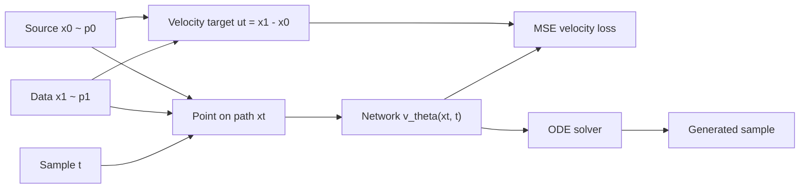

## Introduction

Flow matching is a generative modeling framework built around a velocity field. Instead of learning a denoising step for a fixed noise schedule, the model learns how points should move along a continuous path from a source distribution to the data distribution. Lipman et al. introduced flow matching as simulation-free regression for continuous normalizing flows [Flow Matching for Generative Modeling](https://arxiv.org/abs/2210.02747). I use [Flow Matching Guide and Code](https://arxiv.org/abs/2412.06264) as the reading spine here, but the first thing to make concrete is smaller: what path do we choose, what velocity do we regress, and how does that become a sampler?

The object we train is $v_\theta(x, t)$, a neural velocity field. During sampling, start from $x_0 \sim p_0$ and integrate the learned field until $t=1$. If the field points in the right direction along the path, the final sample should look like data.



The useful sequence is short: choose a path, compute its velocity target, train with a regression loss, then sample by integrating the learned field.

## Problem setup

Let $p_0$ be an easy source distribution, usually a standard Gaussian, and let $p_1$ be the target data distribution. A time-dependent flow moves a point by the ordinary differential equation

$$
\frac{d x_t}{dt} = v_t(x_t).
$$

The initial sample is $x_0 \sim p_0$.

The distribution of $x_t$ changes over time. We can call this changing distribution $p_t$. The ideal goal is to choose a velocity field $v_t$ such that $p_t$ starts at $p_0$ and ends at $p_1$.

The unavailable object is the direct marginal velocity target, not the conditional velocity target from sampled endpoints used below. At intermediate times, data do not give the exact marginal distribution $p_t$ or the global field $v_t$ that transports it. Conditional flow matching sidesteps that missing marginal target by conditioning on sampled endpoints, where the velocity along the chosen path is available.

## Path and velocity target

Sample a source point $x_0 \sim p_0$, a data point $x_1 \sim p_1$, and a time $t \sim \mathcal{U}(0, 1)$. The simplest conditional path is a straight line:

$$
x_t = (1 - t)x_0 + t x_1.
$$

The velocity along this path is its derivative:

$$
u_t = \frac{d x_t}{dt} = x_1 - x_0.
$$

This turns the problem into supervised velocity prediction. The network sees the current position $x_t$ and time $t$, then predicts the velocity that should move the sample along the path.



At this point, the learning problem is just supervised velocity prediction. The later sampling step uses the learned average direction at each location and time, rather than the original endpoint pair.

## Training objective

For the straight-line path, the training loss is

$$
\mathcal{L}(\theta)=\mathbb{E}_{t,x_0,x_1}[\ell_\theta],
$$

$$
\ell_\theta=\left\|v_\theta(x_t,t)-(x_1-x_0)\right\|_2^2.
$$

This objective is useful because training does not solve the sampling ODE. Each step only needs four operations: sample endpoints, sample time, interpolate, and regress the velocity.

## Minimal implementation

The training core for the straight-line conditional path is only a few lines.

```python
import torch


def expand_time(t: torch.Tensor, x: torch.Tensor) -> torch.Tensor:
    while t.ndim < x.ndim:
        t = t.unsqueeze(-1)
    return t


def interpolate(x0: torch.Tensor, x1: torch.Tensor, t: torch.Tensor) -> torch.Tensor:
    t = expand_time(t, x0)
    return (1.0 - t) * x0 + t * x1


def flow_matching_loss(model, data: torch.Tensor) -> torch.Tensor:
    x1 = data
    x0 = torch.randn_like(x1)
    t = torch.rand(x1.shape[0], device=x1.device)

    xt = interpolate(x0, x1, t)
    velocity_target = x1 - x0
    velocity_pred = model(xt, t)

    return torch.mean((velocity_pred - velocity_target) ** 2)
```

This is the training target in code. `x0` is fresh Gaussian noise, `x1` is a batch of real data, `t` chooses a point between them, `xt` is that interpolated point, and `x1 - x0` is the velocity the model learns to predict.

## Code result

A 2D check with a linear velocity model and a two-cluster target reduced the velocity-regression loss from 3.479 to 2.010 over 520 steps. The run is small, but it shows the training signal doing the right job: the model sees interpolated points and learns the velocity direction that moves them toward the sampled data endpoint.



The path plot makes the sampling side concrete. Black dots are initial source samples, blue curves are Euler-integrated trajectories under the learned field, and red points are the target data cloud.



The limitation is also visible. Straight lines between independently paired noise and data points are easy to train on, but they are not always the best path for every domain.

## Sampling procedure

There is one theoretical step to connect training and sampling. Training uses conditional endpoint pairs $(x_0, x_1)$, but sampling starts from fresh noise without choosing a target endpoint. Flow matching shows that the conditional regression objective has the right population optimum for the marginal velocity field under the chosen probability path. This conditional-to-marginal argument is the core idea behind flow matching and conditional flow matching [Flow Matching for Generative Modeling](https://arxiv.org/abs/2210.02747), [Improving and Generalizing Flow-Based Generative Models with Minibatch Optimal Transport](https://arxiv.org/abs/2302.00482).

After training, discard the paired endpoint construction. Sampling starts from fresh noise and follows the learned vector field:

$$
\frac{d x_t}{dt} = v_\theta(x_t,t).
$$

Again, the initial sample is $x_0 \sim p_0$.

A numerical ODE solver approximates

$$
x_1 \approx x_0+\int_0^1 v_\theta(x_t,t)\,dt.
$$

The number of solver steps controls the speed-quality tradeoff. More steps usually track the learned field more accurately; fewer steps are faster but can expose errors in the learned trajectory. This is why path design matters: rectified flow studies straight transports for fast sampling [Flow Straight and Fast](https://arxiv.org/abs/2209.03003), while stochastic interpolants connect flow and diffusion viewpoints through broader interpolating processes [Stochastic Interpolants](https://arxiv.org/abs/2303.08797). The official [`facebookresearch/flow_matching`](https://github.com/facebookresearch/flow_matching) library is the best place to check current implementation patterns.

## Next part

Part 2 will implement the sampling loop and compare how ODE step count and path choice change the generated samples.

## References and visual resources

- Primary guide and paper: [Flow Matching Guide and Code](https://arxiv.org/abs/2412.06264).
- Core paper: [Flow Matching for Generative Modeling](https://arxiv.org/abs/2210.02747).
- Conditional flow matching and minibatch OT: [Improving and Generalizing Flow-Based Generative Models with Minibatch Optimal Transport](https://arxiv.org/abs/2302.00482).
- Related straight-path view: [Flow Straight and Fast: Learning to Generate and Transfer Data with Rectified Flow](https://arxiv.org/abs/2209.03003).
- Related interpolant view: [Stochastic Interpolants: A Unifying Framework for Flows and Diffusions](https://arxiv.org/abs/2303.08797).
- Official codebase: [`facebookresearch/flow_matching`](https://github.com/facebookresearch/flow_matching).
- Visual reference: [A Visual Dive into Conditional Flow Matching](https://dl.heeere.com/conditional-flow-matching/blog/conditional-flow-matching/) uses diagrams for the probability path and velocity field.
- Compact technical reference: [Flow Matching: A Minimal Guide](https://www.weideng.org/posts/flow_matching/) lays out the ODE, continuity equation, and flow matching loss.
- Implementation-oriented walkthrough: [Flow Matching from Scratch](https://daddaops.com/blog/flow-matching-from-scratch/) shows the straight-line path and training loop in a beginner-friendly way.
