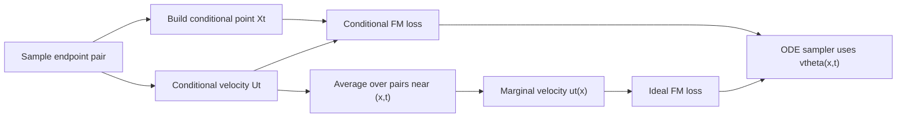

## Introduction

The sampler in Part 2 never chooses a target endpoint. It starts from noise and follows $v_\theta(x,t)$. Training, however, used endpoint pairs. The Flow Matching Guide states the bridge directly: under the marginalization trick, conditional velocity fields can be averaged into a marginal velocity field that generates the marginal probability path [Flow Matching Guide and Code](https://arxiv.org/abs/2412.06264). The original paper gives the same construction for conditional probability paths and states that the Flow Matching and Conditional Flow Matching objectives have identical gradients [Flow Matching for Generative Modeling](https://arxiv.org/abs/2210.02747).

The useful way to read the result is local. Around one position and one time, many endpoint pairs may pass nearby. Each pair proposes a conditional velocity. The marginal field is the average direction that the sampler should use at that location.



## Problem setup

Let $Z$ denote the conditioning information used to create a training target. In the straight endpoint-pair version, $Z=(X_0,X_1)$. At a sampled time $t$, the conditional point is

$$
X_t=(1-t)X_0+tX_1.
$$

The endpoint-conditioned velocity is

$$
U_t=X_1-X_0.
$$

During training, the model sees $(X_t,t)$ and regresses toward $U_t$. During sampling, $Z$ is absent. A generated point has only its current state and time.

## Path and velocity target

The marginal field is the conditional average of the endpoint-conditioned velocity at the current location:

$$
u_t(x)=\mathbb{E}[U_t\mid X_t=x].
$$

For a more general conditioning variable $Z$, the guide writes the same idea as an average of conditional velocities:

$$
u_t(x)=\mathbb{E}[u_t(X_t|Z)\mid X_t=x].
$$

This is the field the sampler wants. It is not a single endpoint arrow. It is the average of all conditional arrows compatible with the same local state.

There are several valid choices for what goes into $Z$. The next formula is target-conditioned, not paired-endpoint conditioned: it fixes the data endpoint $x_1$ and writes the velocity as a function of the current state $x$. If the path is conditioned only on $x_1$, the conditional velocity is

$$
u_t(x|x_1)=\frac{x_1-x}{1-t}.
$$

The paired-endpoint implementation uses the same averaging principle with $Z=(X_0,X_1)$ and the simple velocity $X_1-X_0$.

## Training objective

The ideal marginal Flow Matching loss would regress directly to $u_t(X_t)$:

$$
\mathcal{L}_{\mathrm{FM}}(\theta)=
\mathbb{E}\left[\|v_\theta(X_t,t)-u_t(X_t)\|_2^2\right].
$$

That target is usually unavailable because it already requires the local average over endpoint pairs. Conditional Flow Matching uses the tractable target:

$$
\mathcal{L}_{\mathrm{CFM}}(\theta)=
\mathbb{E}\left[\|v_\theta(X_t,t)-U_t\|_2^2\right].
$$

The population-level statement used here has a narrow scope: it compares the marginal and conditional objectives for the same conditional path, under the regularity assumptions that justify differentiating and marginalizing the loss. In that setting, the gradient equivalence is

$$
\nabla_\theta \mathcal{L}_{\mathrm{FM}}(\theta)=
\nabla_\theta \mathcal{L}_{\mathrm{CFM}}(\theta).
$$

Within that population objective, the minimizer of the conditional objective is the marginal velocity. This is why endpoint-conditioned targets can train a field that later samples without a chosen endpoint.

## Minimal implementation

The code target is still the same regression loop. The only extra diagnostic is to inspect the average of conditional arrows near a location.

```python
import torch


def endpoint_batch(data: torch.Tensor) -> tuple[torch.Tensor, torch.Tensor, torch.Tensor]:
    x1 = data
    x0 = torch.randn_like(x1)
    t = torch.rand(x1.shape[0], device=x1.device)
    xt = (1.0 - t[:, None]) * x0 + t[:, None] * x1
    target_velocity = x1 - x0
    return xt, t, target_velocity


def local_average_velocity(
    xt: torch.Tensor,
    target_velocity: torch.Tensor,
    query: torch.Tensor,
    radius: float,
) -> torch.Tensor:
    keep = torch.linalg.norm(xt - query[None, :], dim=1) <= radius
    return target_velocity[keep].mean(dim=0)
```

The first function is the training target. The second function is a diagnostic version of the marginalization idea: keep endpoint pairs whose interpolated point lies near the query and average their velocities.

## Code result

The local plot fixes $t=0.55$ and marks one query location. The left panel shows which interpolated points form the neighborhood. The right panel zooms into that neighborhood: gray arrows are endpoint-conditioned velocity directions from sampled pairs, and the teal arrow is their empirical local average.



The run sampled 5,000 endpoint pairs and kept the 26 nearest interpolated points around the query. The local average velocity was approximately $(-0.126, 0.131)$. The exact number is not the point; the useful object is the distinction between many conditional arrows and one finite-sample estimate of the marginal direction.

## Sampling procedure

Sampling uses the learned approximation to the marginal field:

$$
\frac{dX_t}{dt}=v_\theta(X_t,t).
$$

No target endpoint is sampled during generation. The endpoint construction lives in the training objective, where it supplies cheap supervised velocity targets. At population scale, the conditional objective pushes the model toward the same marginal velocity field that the ODE sampler needs.

This also explains why Part 2 could integrate a field without carrying endpoint labels. The solver does not know which data point a generated sample will approach. It only evaluates a learned average direction at the current location and time.

## Next part

Part 4 changes the endpoint coupling and measures how pairing alters path geometry.

## References and visual resources

- Primary guide and codebase paper: [Flow Matching Guide and Code](https://arxiv.org/abs/2412.06264).
- Core paper: [Flow Matching for Generative Modeling](https://arxiv.org/abs/2210.02747).
- Conditional flow matching and minibatch OT: [Improving and Generalizing Flow-Based Generative Models with Minibatch Optimal Transport](https://arxiv.org/abs/2302.00482).
- Visual reference: [A Visual Dive into Conditional Flow Matching](https://dl.heeere.com/conditional-flow-matching/blog/conditional-flow-matching/) uses path and velocity diagrams that help separate conditional and marginal objects.
- Compact technical reference: [Flow Matching: A Minimal Guide](https://www.weideng.org/posts/flow_matching/) gives a concise conditional-expectation view of the training target.
