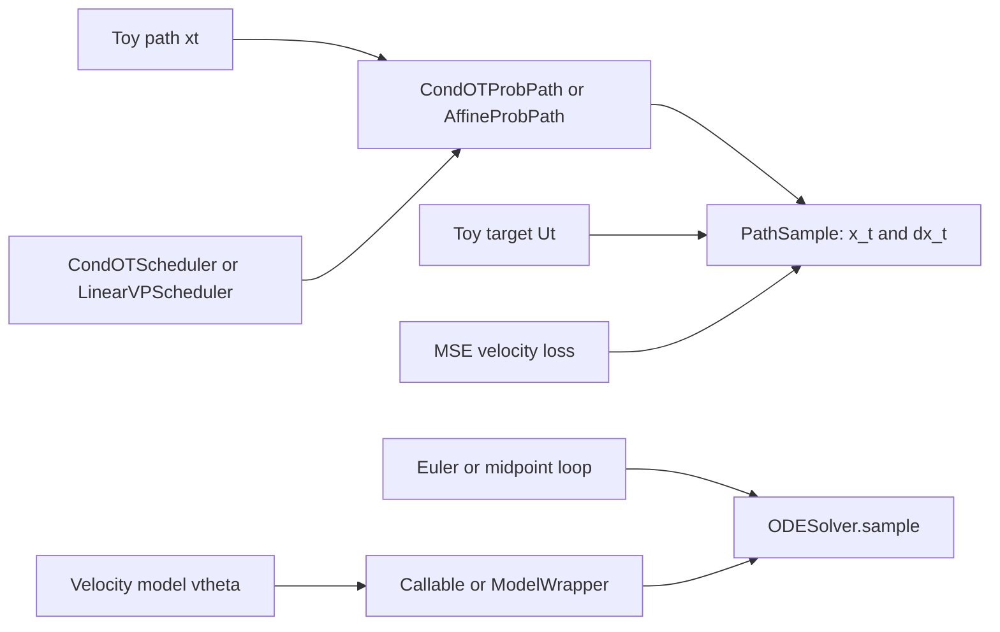

## Introduction

The toy code has four moving parts: a probability path, a velocity target, a velocity model, and an ODE sampler. The official [`flow_matching`](https://github.com/facebookresearch/flow_matching) package keeps the same separation. The repository describes a PyTorch library for continuous and discrete flow matching implementations, with path, scheduler, solver, loss, and example modules tied to the Flow Matching Guide and Code paper [Flow Matching Guide and Code](https://arxiv.org/abs/2412.06264).

In `flow_matching==1.0.10`, the package exports `CondOTProbPath`, `AffineProbPath`, scheduler classes such as `CondOTScheduler` and `LinearVPScheduler`, and `ODESolver` for continuous sampling.



## Problem setup

The package does not remove the conceptual work. It gives names and tested APIs for the same objects:

| Tutorial object          | Package object in `flow_matching==1.0.10` |
| ------------------------ | ----------------------------------------- |
| Conditional OT path      | `CondOTProbPath`                          |
| General affine path      | `AffineProbPath`                          |
| Conditional OT scheduler | `CondOTScheduler`                         |
| Linear VP scheduler      | `LinearVPScheduler`                       |
| Continuous ODE sampler   | `ODESolver`                               |
| Model wrapper option     | `ModelWrapper`                            |

For the continuous path used in this series, the path object returns a `PathSample` with `x_t` and `dx_t`. The training loop can then use a standard PyTorch regression loss between the model output and `dx_t`.

## Path and velocity target

The package path object owns the schedule and target construction. For Conditional OT:

```python
import torch
from flow_matching.path import CondOTProbPath


path = CondOTProbPath()
x0 = torch.randn(batch_size, 2)
x1 = data_batch
t = torch.rand(batch_size)

sample = path.sample(x0, x1, t)
xt = sample.x_t
velocity_target = sample.dx_t
```

For a custom affine schedule, use `AffineProbPath` with a scheduler:

```python
from flow_matching.path import AffineProbPath
from flow_matching.path.scheduler import LinearVPScheduler


path = AffineProbPath(scheduler=LinearVPScheduler())
sample = path.sample(x0, x1, t)
```

That mapping is the package version of the equations from Part 5.

## Training objective

The continuous training objective remains velocity regression:

$$
\mathcal{L}(\theta)=
\mathbb{E}\left[\|v_\theta(X_t,t)-\dot{X}_t\|_2^2\right].
$$

In code, `sample.dx_t` is the target:

```python
pred = velocity_model(sample.x_t, sample.t)
loss = torch.mean((pred - sample.dx_t) ** 2)
```

## Minimal implementation

For `flow_matching==1.0.10`, the continuous solver API is `ODESolver.sample`. It accepts `x_init`, `step_size`, `method`, `time_grid`, and `return_intermediates`.

```python
import torch
from flow_matching.solver import ODESolver


solver = ODESolver(velocity_model=velocity_model)
time_grid = torch.linspace(0.0, 1.0, 33)

samples = solver.sample(
    x_init=x0,
    step_size=1.0 / 32,
    method="midpoint",
    time_grid=time_grid,
    return_intermediates=False,
)
```

The velocity model can be a callable or a `ModelWrapper`. Extra keyword arguments passed to `sample` are forwarded to the velocity model, which is useful for conditional checks and guided settings.

## Code result

The package bridge run uses `CondOTProbPath` to sample exact conditional path points, then uses `ODESolver` with the matching conditional velocity to integrate the same endpoints up to $t=0.98$. The figure separates the API wiring from the verified output. In the path panel, solid blue curves are solver trajectories and dashed orange curves are the exact path samples drawn on top of them.



The solver-to-path agreement metric compares the final solver state with the `CondOTProbPath` sample at the same final time, $t=0.98$. The residual inset magnifies only that tiny terminal gap. The displayed remaining distance to the endpoint is separate: it is the intentional path segment from $t=0.98$ to $t=1$, not solver error. The point of the run is API wiring: the path object, velocity callable, and solver agree on tensor shapes and time arguments.

## Sampling procedure

For a trained continuous model, the package sampling pattern is direct:

1. choose the source batch `x_init`;
2. wrap or pass the velocity model;
3. choose `time_grid`, `method`, and `step_size`;
4. call `ODESolver.sample`.

The conceptual checks from the earlier parts still apply. The solver method should match the field's time behavior, the path scheduler should match training, and diagnostics should separate numerical integration error from model quality.

The package also has a discrete branch, including `MixtureDiscreteProbPath`, `MixtureDiscreteEulerSolver`, and `MixturePathGeneralizedKL`. That is separate from the continuous 2D examples used in this series.

## Next part

The series ends with an export checklist after all draft checks pass.

## References and visual resources

- Primary guide and codebase paper: [Flow Matching Guide and Code](https://arxiv.org/abs/2412.06264).
- Official package repository: [`facebookresearch/flow_matching`](https://github.com/facebookresearch/flow_matching).
- Core paper: [Flow Matching for Generative Modeling](https://arxiv.org/abs/2210.02747).
